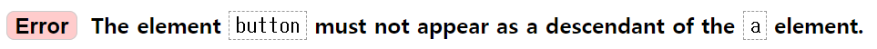
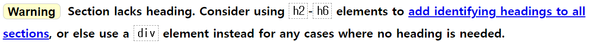

# 에어비앤비 레이아웃 클론코딩

## ✍🏻 학습 내용 정리

### 벤더 접두사 (Vendor Prefixes)

- 웹 브라우저 제조사(vendor)가 특정 브라우저에서만 사용되는 CSS 속성이나 기능을 구현하기 위해 사용하는 접두사(prefix)
- 표준으로 채택되지 않은 CSS 기능이나 실험적인 기능을 사용할 때 필요
- 종류
  - -webkit- : 구글 크롬, 사파리
  - -moz- : 파이어폭스
  - -ms- : 익스플로러(IE)
  - -o- : 오페라
- 활용 예제

  ```javascript
  // 텍스트를 투명하게 처리하고, 그라디언트 배경이 노출되는 설정

  button span {
    background: linear-gradient(90deg, #6F019C 0%, #C6017E 135.12%);
    // 텍스트모양으로 배경을 클리핑(자르기) - 구버전 웹킷 브라우저용
    -webkit-background-clip: -webkit-text;
    // 텍스트모양으로 배경을 클리핑(자르기) - 최신 버전 웹킷 브라우저용
    -webkit-background-clip: text;
    // 텍스트를 투명하게 설정하여 배경색이 보이도록 설정
    -webkit-text-fill-color: transparent;
  }
  ```

<hr>

## 🤔 문제 및 고려사항

### HTML 유효성 검사

- **`<a>`내부에 `<button>` 포함 불가**
  {: width="580"}

  - `<a>` 자체가 버튼이어야 할 경우, `<a>`의 CSS 스타일링을 버튼처럼 설정
  - `<a>` 내부에 버튼이 존재해야 할 경우, `a` 내부에 `<div>`를 CSS 스타일링을 버튼처럼 설정
    <br/>

- **`<section>` 내부에 heading 포함 권장 (예: `h2`~`h6`)**
  {: width="700"}

  - 독립적인 내용을 담고 있지 않은 경우나, 단순 컨테이너로서 스타일링/레이아웃 목적으로 사용될 경우에는 `<section>` 대신 `<div>`를 사용하는 것이 적절

  - `<section>`을 사용하는 것이 의미적으로는 적절하지만, heading을 노출시키지 않아야 할 경우에는 시각적으로는 숨기고 스크린 리더에만 읽힐 수 있도록 CSS로 스타일링 설정
